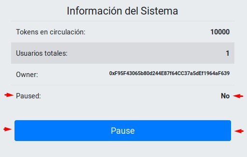
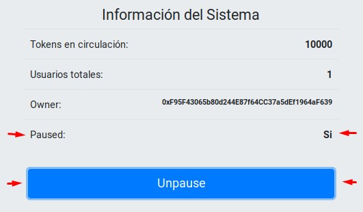

# PEC 1 - Diseño y Desarrollo II
### Alumno: Jesús A. Leal Pérez
---
# Dapp - Recolección de Envases para Reciclaje

En construcción...


### Indice

- [Acerca esta Dapp](#acerca-esta-dapp)

- [Puntos evaluables](#puntos-evaluables)

### Acerca esta Dapp

Esta Dapp intenta simular el mecanismo con el que se le gratificaría a un usuario por la
entrega de envases para su reciclado.

Básicamente se introduciría el código de barras en la etiqueta del envase y, siempre que
estuviese registrado en el sistema, se asignaría una cantidad de tokens establecidos por
una tarifa definida para dicho envase. En caso de no estar registrado, se asignaría un
token por cada unidad recolectada.


## Estructura
...

## ¿Cómo instalar y configurar?
...

### Versiones programas utilizados

- Truffle v5.0.24  
- Node v8.10.0  
- Solc: 0.5.0+commit  


## Casos de uso
...

## ¿Cómo utilizar la Dapp?
...

## Pruebas
...

---
## Puntos evaluables
---
### LIBRERIA - Utilizar un librería existente de OpenZeppelin o EthPM

Se ha utilizado la librería **Safemath.sol** de OpenZeppelin

Su versión original se puede encontrar en:
[https://github.com/OpenZeppelin/openzeppelin-contracts/blob/master/contracts/math/SafeMath.sol](https://github.com/OpenZeppelin/openzeppelin-contracts/blob/master/contracts/math/SafeMath.sol)

Sin embargo, se han incluido dos funciones nuevas para la suma y resta de enteros de 32 bytes (para los contadores utilizados en _Recycler.sol_)

---
### SMART CONTRACTS - Uso de algún mecanismo como Herencia o Factory Contracts

Se han implementado ambos mecanismos:


#### 1) Herencia

Se han utilizados los contratos de OpenZeppelin:

**Pausable.sol**

Su versión original se puede encontrar en:
[https://github.com/OpenZeppelin/openzeppelin-contracts/blob/master/contracts/lifecycle/Pausable.sol](https://github.com/OpenZeppelin/openzeppelin-contracts/blob/master/contracts/lifecycle/Pausable.sol)

> En nuestro caso se han hecho algunas modificaciones para:
- Se simplifica para que el owner del contrato sea la única persona que pueda invocar las funciones _pause()_ y _unpause()_.
- Se incluye herencia de _Ownable.sol_ para poder implementar el cambio anterior.

**Ownable.sol**

Su versión original se puede encontrar en:
[https://github.com/OpenZeppelin/openzeppelin-contracts/blob/master/contracts/ownership/Ownable.sol](https://github.com/OpenZeppelin/openzeppelin-contracts/blob/master/contracts/ownership/Ownable.sol)

> Se ha utilizado una versión antigua adaptada para que la dirección del owner sea payable y se le pueda transferir el saldo del contrato sin necesidad de hacer posteriores conversiones de la dirección (de _address_ a _address payable_).

También se ha utilizado el contrato de _Provable_:

**provableAPI_0.5.sol**

En este se incluye todos los contratos necesarios para trabajar con oráculos.

Su versión original se puede encontrar en:
[https://github.com/provable-things/ethereum-api/blob/master/provableAPI_0.5.sol](https://github.com/provable-things/ethereum-api/blob/master/provableAPI_0.5.sol)


En resumen:
* El contrato _Pausable_ hereda de _Ownable_ 
* El contrato _Recycler_ hereda de _Pausable_ y _usingProvable_ (en provableAPI_0.5.sol), implementando todas las funciones de estos tres contratos.

>_contract Pausable is Ownable_  
>_contract Recycler is usingProvable, Pausable_  


#### 2) Factory Contracts

Se ha creado el contrato **UserFactory** (en _Recycler.sol_) encargado de gestionar por separado los movimientos de tokes de cada uno de los usuarios (direcciones) que utilicen la dapp.

En el contrato _Recycler_, dentro de los datos de cada usuario (struct user) se incluye el _factory contract_(userContr) que gestionará sus movimientos:
````
    //* Estructura para datos de usuarios
    struct User {
        uint    balance;
        uint    dtUltMvt;
        uint32  countMvts;
        uint32  seq;
        UserFactory userContr;
    }
````
---
### SMART CONTRACTS - Implementar una parada de emergencia en el contrato (Circuit Breaker / Emergency Stop)

Se implementa una parada de emergencia a trávez de las funciones **Pause()** y **Unpause()** definidas en _Pausable.sol_ y la utilización de los modificadores **whenNotPaused()** y **whenPaused()** en algunas de las funciones del contrato principal _Recycler_.

Esta implementación se ha hecho a través de un botón de **"Pause"** que aparece al final de la pantalla y se habilita únicamente cuando la _address_ activa es la del _owner_ del contrato. Además, se muestra el estado actual del contrato:





Esto es gestionado a través de los eventos **Paused()** y **Unpaused()**.

### SMART CONTRACTS - Medidas adoptadas en los contratos en cuanto a seguridad para evitar ataques típicos.

### SMART CONTRACTS - Posibles patrones de actualización que usaría en el contrato (No es necesario realizar la implementación)

### SMART CONTRACTS - Comentar los contratos según lo indicado en https://solidity.readthedocs.io/en/latest/layout-of-source-files.html#comments

---
### TESTING - Justifiación test creados y explicación función que realizan cada uno.

### TESTING - Todos los test se ejecutan satisfactoriamente.

### TESTING - Realizar comentarios sobre el código de los tests.
---
### EXTRAS - Alojar el/los contrato/s en una testnet y verificar el código
Detallar procedimiento e indicar las direcciones

### EXTRAS - Alojar la aplicación en IPFS / Swarm
Detallar procedimiento e indicar los hash

### EXTRAS - Utilizar ENS (no para referirse a un hash de Swarm)
Detallar procediiento y funcionamiento / caso de uso del ENS en la aplicación

### EXTRAS - Uso de oráculos
Detallar procedimiento realizado, añadir guía para el lanzamiento del oráculo y dejar claro su funcionamiento


