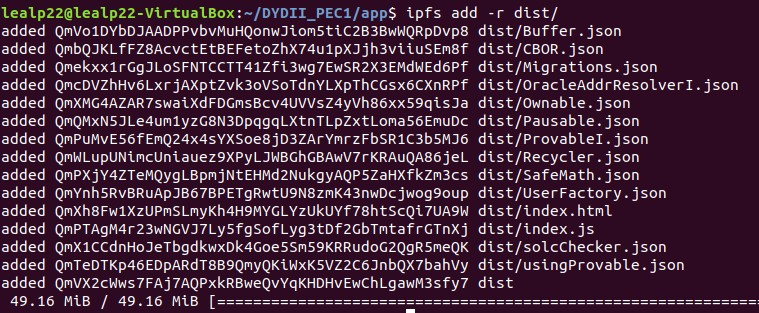
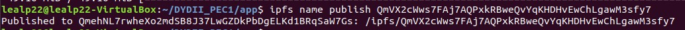
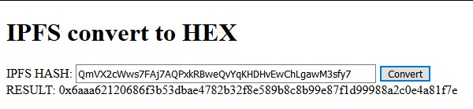

# PEC 1 - Diseño y Desarrollo II
### Realizada por: [Jesús A. Leal Pérez](mailto:lealp22@yahoo.com)
---
# Dapp - Recolección de Envases para Reciclaje

## Indice

- [Acerca esta Dapp](#acerca-esta-dapp)
- [Funcionamiento](#funcionamiento)
- [Productos registrados](#productos-registrados)
- [¿Cómo utilizar la Dapp?](#como-utilizar-la-dapp)
- [Estructura de la Dapp](#estructura-de-la-dapp)
- [Entorno](#entorno)
- [¿Cómo instalar y ejecutar en local?](#cómo-instalar-y-ejecutar-en-local)
- [Puntos evaluables](#puntos-evaluables)
    - [Interfaz](#interfaz)
    - [Librería](#libreria---utilizar-una-librería-existente-de-openzeppelin-o-ethpm)
    - [Smart Contracts](#smart-contracts---uso-de-alg%C3%BAn-mecanismo-como-herencia-o-factory-contracts)
    - [Testing](#testing---justifiación-test-creados-y-explicación-función-que-realizan-cada-uno)
    - [Extras](#extras---alojar-ellos-contratos-en-una-testnet-y-verificar-el-código)

---

## Acerca esta Dapp

Esta Dapp intenta simular el mecanismo con el que se le gratificaría a un usuario por la
entrega de envases para su reciclado.

Básicamente se introduciría el código de barras que está en la etiqueta del envase y, siempre que estuviese registrado en el sistema, se asignaría una cantidad de tokens establecidos por una tarifa asociada a dicho envase. En caso de no estar registrado, se asignaría un token por cada unidad recolectada.

  
[Fuente: 20minutos.es](https://blogs.20minutos.es/capeando-la-crisis/2018/02/07/maquinas-que-dan-dinero-por-reciclar-botellas-de-plastico-las-queremos-en-espana/)  

Esta Dapp se ha desarrollado con webpack tomando [Metacoin](https://www.trufflesuite.com/tutorials/building-testing-frontend-app-truffle-3) como punto de partida.

---
## Funcionamiento

La página web de la aplicación lucirá de la siguiente forma:


Contando con los siguientes elementos:

### Panel lateral izquierdo: 

Muestra información sobre la cuenta con la que se está trabajando y la sesión.

Este se compone de:

- **Estado**: Muestra la última acción relevante realizada por la Dapp en relación a la cuenta que se está utilizando.

- **Cuenta**: Dirección de la cuenta con la se está trabajando.

- **Saldo tokens:** Saldo de tokens asignado a la cuenta.

- **Red**: Id de la red sobre la que se está trabajando.

- **Log**: Log en el que se muestra el historial de mensajes que ha aparecido en el recuadro de _'Estado'_.


### Panel 'Recolección':

Área donde el usuario deberá introducir los datos del envase a reciclar y a partir de los cuales se asignará en compensación un número determinado de tokens:

Los campos son los siguientes:

- **Código**: Código de barra que aparece en la etiqueta del envase a reciclar. Puede utilizarse cualquier código, sin embargo, los indicados en [Productos registrados](#productos-registrados) tienen una tarifa asignada y utilizan el oráculo para recuperar el número de tokens a asignar. Para el resto se entrega un token por unidad.

- **Descripción**: Se muestra la descripción asociada al código (si registrada).

- **Cantidad**: Número de unidades entregadas.

- **Medida**: Unidad de medida (Unidades o Kilos).

- **Tokens**: Número de tokens que serán entregados. Si el código está registrado se calculará multiplicando el número de tokens de la tarifa correspondiente por el número de unidades entregadas. Si no, se entregará un token por cada unidad.

- **Botón \[Enviar]**: Botón para realizar la transacción. Se habilita al introducir un código.


### Panel 'Últimas Recolecciones':

En esta área se muestran las últimas 5 transacciones realizadas con la cuenta con que se está trabajando.

Los campos de la tabla de movimientos corresponden a los campos introducidos en el panel de _'Recolección'_.


Bajo esta tabla se muestra el número total de transacciones de la cuenta.

>_Observación_: 
>- La cuenta del _owner_ siempre tendrá una primera transacción con el código 'coinbase' que justifica los 10.000 tokens que le son entregados con el despliegue del contrato.
>- Actualmente se muestra en la columna _'Descripción'_ la tarifa que se haya utilizado para calcular los tokens. Esto se utiliza así para poder comprobar el valor devuelto por el oráculo.

### Panel 'Información del Sistema':

En esta área se muestra información general del sistema:

- **Tokens en circulación**: Número total de tokens existentes en las cuentas de los usuarios.

- **Usuarios totales**: Número total de usuarios (únicos) que han utilizado la Dapp.

- **Owner**: Dirección del owner del contrato.

- **Paused**: Indica el estado de la Dapp en cuanto a si se ha activado el 'circuit break'.

- **Botón \[Pause]/\[Unpause]**: Botón que permite activar/desactivar la parada del sistema. Solo se habilita para el _owner_. Una vez activada solo se permiten realizar operaciones de consulta o detener por completo el contrato (funcionalidad no implementada en UI)


---

## Productos registrados

Estos son los códigos de barra que actualmente tiene una tarifa asociada y para las que se utiliza el oráculo para obtener el número de tokens que les corresponden.

| Código | Descripción | Tarifa | Tokens |
|--------|-------------|--------|--------|
| 8410128160319 | Agua Mineral Bezoya 50cl | F0101 | 10 |
| 8411547001009 | Agua Mineral Solan De Cabras 75cl | F0101 | 10 |
| 8410297110979 | Leche Entera Asturiana 2,2L | F0101 | 10 |
| 8411800318950 | Trina Naranja 33cl | F0102 | 15 |

La información de estos códigos es consultada a través de APIs genéricas provistas por [mLab](https://mlab.com).

---
## ¿Cómo utilizar la Dapp?


Para realizar una transacción tan solo será necesario introducir los datos en el panel de "Recolección".

**1º)** Se deberá introducir el código de barra del envase a reciclar.  
    - Si el código estuviese registrado en el sistema (ver lista [productos registrados](#productos-reistrados)), se mostrará la descripción y se calculará el número total de tokens que se entregarán.  
    - Si no, se mostrará el texto "unkown" en la descripción y se entregará un token por cada unidad entregada.

**2º)** Se introduce el número de envases a reciclar.

**3º)** Se selecciona la unidad de medida: Unidades o Kilos.

**4º)** Haga click sobre el botón \[Enviar] (Este botón se habilita al introducir un código).

**5º)** Aceptar la transacción con Metamask.

**6º)** Aparecerá un mensaje de confirmación indicando los tokens entregados y el hash de la transacción.


> **Observación**: Si se utiliza el código de un [producto registrado](#productos-reistrados) se deberá esperar la respuesta del oráculo, por lo que la confirmación del paso 6 podrá tardar unos segundos. Se ruega paciencia.

**Si el usuario es el owner**, también podrá activar el _circuit-break_ a través del botón \[Pause] que aparece en el panel de ["Información del Sistema"](#panel-información-del-sistema). Si por el contrario, este ya estuviese activado, el botón aparecerá con la etiqueta _"Unpause"_.

Para más detalles, ver implementación de [parada de emergencia](#smart-contracts---implementar-una-parada-de-emergencia-en-el-contrato-circuit-breaker--emergency-stop).


---
## Estructura de la Dapp

La estructura de directorios y ficheros es la siguiente:

````
+-- app                         Archivos Javascript y plantilla HTML para nuestra Dapp (UI) 
¦   +-- src  
¦       +-- index.html          +-- Plantilla HTML para la UI de la Dapp
¦       +-- index.js            +-- Codificación UI de la Dapp
¦   +-- dist                    
¦   +-- package.json            +-- Configuración NPM para UI  
¦   +-- webpack.config.js       +-- Configuración para Webpack
¦  
+-- build                       "Artifacts" u objetos generados en la compilación de los Smart Contracts  
|   +-- contracts
¦  
+-- contracts                   Archivos fuentes de los Smart Contracts utilizados en la Dapp
¦   +-- Recycler.sol            +-- Smart Contract principal de la Dapp  
¦   +-- Migrations.sol          +-- SC para la migración  
¦   +-- Ownable.sol             +-- SC de OpenZeppelin para gestionar el owner de un contrato 
¦   +-- Pausable.sol            +-- SC de OpenZeppelin para implementar paradas en contratos
¦   +-- provableAPI_0.5.json    +-- SC de Provable para la implementación de oráculos
¦   +-- SafeMath.sol            +-- Librería de OpenZeppelin para operaciones aritméticas
¦  
+-- migrations                  Scripts para la implementación del contrato  
¦   +-- 1_initial_migration.js  +-- Despliegue de SC de migración  
¦   +-- 2_deploy_contracts.js   +-- Despliegue del SC Recycler  
¦
+-- test                        Scripts para test unitarios  
¦   +-- recycler.js             +-- Tests para el contrato Recycler
¦  
+-- truffle-config.js           +-- Configuración para Truffle  
````

**En resumen:** 
- La interfaz (UI) de la Dapp se ha construido con la plantilla HTML __index.html__ y la lógica codificada en el JavaScript __index.js__.
- Dentro de __Recycler.sol__ están codificados los SC __Recycler__ y __UserFactory__. El SC principal es _Recycler_ y utiliza a _UserFactory_ para gestionar por separado los movimientos de cada usuario (implementa la parte de _Factory Contracts_).
- Las pruebas unitarias se han codificado en __recycler.js__.

---
### Entorno

Se requiere tener instalado en el entorno el siguiente software:

- Git
- Npm
- Node.js
- Truffle
- Web3
- Metamask
- Ganache (opcional)

Las versiones instaladas al probar esta Dapp eran las siguientes:

- Truffle v5.0.24  
- Node v8.10.0  
- Solc v0.5.10
- Npm v6.9.0
- Web3 v1.0.0
- Ganacle-cli@6.4.4
- MetaMask v7.1.1

---
## ¿Cómo instalar y ejecutar en local?

Para poder ejecutar en local es necesario realizar los siguientes pasos:

**1)** Clonar el repositorio desde GitHub:

    $ git clone https://github.com/lealp22/DYDII_PEC1.git

**2)** Entrar al siguiente directorio e instalar dependencias:

    $ cd DYDII_PEC1/app
    $ npm install

**3)** Ejecutar Truffle:

    $ truffle develop

>(En este punto también se podría utilizar _Ganache_, siempre que apunte a la dirección http://127.0.0.1:9545)

**4)** Abrimos un nuevo terminal y desde el mismo directorio (DYDII_PEC1/app) ejecutamos:

    $ npx ethereum-bridge -a 9 -H 127.0.0.1 -p 9545 --dev

>Con este paso se ejecuta el servicio _ethereum-bridge_, necesario para que el oráculo de la Dapp funciones en local


**5)** Compilar los Smart Contracts:

    Desde Truffle: > compile
    Desde la línea de comandos (Ganache): $ truffle compile

**6)** Migrar los Smart Contracts:

    Desde Truffle: > migrate
    Desde la línea de comandos (Ganache): $ truffle migrate

**7)** Ejecutamos el test unitario para comprobar el correcto funcionamiento:

    Desde Truffle: > test
    Desde la línea de comandos (Ganache_): $ truffle test

**8)** Abrimos un nuevo terminal y, una vez ethereum-bridge esté escuchando, ejecutamos (desde el mismo directorio que en los pasos anteriores --DYDII_PEC1/app--):

    $ npm run dev


**9)** Completado el paso anterior, ya podemos ejecutar la Dapp desde nuestro navegador con la siguiente url:

>[http://localhost:8080](http://localhost:8080)

__Observaciones:__ Se aconseja importar la primera clave privada de la lista de cuentas a Metamask. De esta forma se podrá utilizar las funcionalidades disponibles unicamente para el _Owner_.


---

# Puntos evaluables

## INTERFAZ

| Tareas | Observaciones |
|--------|---------------|
| Ejecución de la aplicación en un servidor local (localhost) | Ver [¿Cómo instalar y ejecutar en local?](#cómo-instalar-y-ejecutar-en-local) |
| Visitar desde el navegador la URL correspondiente y que se realice una carga correcta de la aplicación | Ver [¿Cómo instalar y ejecutar en local?](#cómo-instalar-y-ejecutar-en-local) (Paso 9) |
| Interactuar con la aplicación (botones, formularios...) | Ver [¿Cómo utilizar la Dapp?](#como-utilizar-la-dapp) |
| Mostrar el address actual (en función del proveedor: MetaMask...) | Ver recuadro "Cuenta" en [panel lateral izquierdo](#panel-lateral-izquierdo) |
| Refrescar automáticamente la web en caso de cambiar de address (MetaMask) | En el fuente _index.js_ se ha incluido la siguiente instrucción que permite detectar un cambio de address: _App.web3.currentProvider.publicConfigStore.on(**"update"**, async function(event){...}_
| Firmar transacciones usando MetaMask. | Ver [¿Cómo utilizar la Dapp?](#como-utilizar-la-dapp) (Paso 5) |
| Guiar al usuario final que usa la aplicación sobre lo que está sucediendo en la aplicación | Ver recuadro "Estado" y "Log" en [panel lateral izquierdo](#panel-lateral-izquierdo) |

---

## LIBRERIA - Utilizar una librería existente de OpenZeppelin o EthPM

Se ha utilizado la librería **Safemath.sol** de OpenZeppelin

Su versión original se puede encontrar en [Github.com/OpenZeppelin/SafeMath.sol](https://github.com/OpenZeppelin/openzeppelin-contracts/blob/master/contracts/math/SafeMath.sol).

Sin embargo, se ha modificado para incluir dos funciones nuevas para la suma y resta de enteros de 32 bytes (para los contadores utilizados en _Recycler.sol_)

Mencionar que esta librería no necesita ser desplegada por separado, por lo que no es necesario vincularla en el deploy (_2_deploy_contracts.js_) de los contratos. Todas las funciones de _Safemath_ son _internal_, por lo que la EVM simplemente la incluye dentro del contrato.

---
## SMART CONTRACTS - Uso de algún mecanismo como Herencia o Factory Contracts

Se han implementado ambos mecanismos:


### 1) Herencia

Se han utilizados los contratos de OpenZeppelin:

- **Pausable.sol**

Su versión original se puede encontrar en [GitHub.com/OpenZeppelin/Pausable.sol](https://github.com/OpenZeppelin/openzeppelin-contracts/blob/master/contracts/lifecycle/Pausable.sol).

>En nuestro caso se han hecho algunas modificaciones:
>- Se simplifica para que el owner del contrato sea la única persona que pueda invocar las funciones _pause()_ y _unpause()_.
- Se incluye herencia de _Ownable.sol_ para poder implementar el cambio anterior.

- **Ownable.sol**

Su versión original se puede encontrar en [GitHub.com/OpenZeppelin/Ownable.sol](https://github.com/OpenZeppelin/openzeppelin-contracts/blob/master/contracts/ownership/Ownable.sol).

>Se ha utilizado una versión antigua adaptada para que la dirección del owner sea "payable" y se le pueda transferir el saldo del contrato sin necesidad de hacer posteriores conversiones de la dirección (de "address" a "address payable").

También se ha utilizado el contrato de _Provable_:

- **provableAPI_0.5.sol**

En este se incluye todos los contratos necesarios para trabajar con oráculos.

Su versión original se puede encontrar en [GitHub.com/Provable/provableAPI_0.5.sol](https://github.com/provable-things/ethereum-api/blob/master/provableAPI_0.5.sol)


**En resumen:**
* El contrato _Pausable_ hereda de _Ownable_  
````
contract Pausable is Ownable (en Pausable.sol)
````
* El contrato _Recycler_ hereda de _Pausable_ y _usingProvable_ (en _provableAPI\_0.5.sol_), implementando todas las funciones de estos tres contratos (incluido _Ownable_).
````
contract Recycler is usingProvable, Pausable  (en Recycler.sol)
````

### 2) Factory Contracts

Se ha creado el contrato **UserFactory** (en _Recycler.sol_) encargado de gestionar por separado los movimientos de tokens de cada uno de los usuarios (direcciones) que utilicen la dapp.

En el contrato _Recycler_, dentro de los datos de cada usuario (_struct user_), se incluye el "child contract" **userContr** que gestionará sus movimientos:
````
    //* Estructura para datos de usuarios
    struct User {
        uint    balance;
        uint    dtUltMvt;
        uint32  countMvts;
        uint32  seq;
        UserFactory userContr;
    }
````
---
## SMART CONTRACTS - Implementar una parada de emergencia en el contrato (Circuit Breaker / Emergency Stop)

Se implementa una parada de emergencia a trávez de las funciones **Pause()** y **Unpause()** definidas en _Pausable.sol_ y la utilización de los modificadores **whenNotPaused()** y **whenPaused()** en algunas de las funciones del contrato principal _Recycler_.

Esta implementación se ha hecho a través de un botón de **"Pause"** que aparece al final de la pantalla y se habilita únicamente cuando la _address_ activa es la del _owner_ del contrato. Además, se muestra el estado actual del contrato:


Esto es gestionado a través de los eventos **Paused()** y **Unpaused()**.

---
## SMART CONTRACTS - Medidas adoptadas en los contratos en cuanto a seguridad para evitar ataques típicos.

- Se ha utilizado la librería _Safemath.sol_ para evitar el overflow/underflow en variables numericas.

- Todas las funciones en _Recycler.sol_ llamadas por otras funciones han sido definidas como internas.

????????????????????????????

---

## SMART CONTRACTS - Posibles patrones de actualización que usaría en el contrato (No es necesario realizar la implementación)

????????????????????????????

---

## SMART CONTRACTS - Comentar los contratos según lo indicado en https://solidity.readthedocs.io/en/latest/layout-of-source-files.html#comments

Se han incluido los comentarios en Recycler.sol

---
## TESTING - Justificación test creados y explicación función que realizan cada uno.

**- Test "Se crea un usuario correctamente con el despliegue del contrato"**

Intenta validar las acciones realizadas con el despliegue del contrato (_constructor_).
  
Se valida que:
- Tras el despliegue el contador de usuarios es 1
- Que la dirección de ese primer usuario es la primera cuenta (coinbase)
     
  
**- Test "El sado de la primera cuenta y el sado global de la Dapp son 10000 token"**

Complementa el test anterior en intentar validar las acciones realizadas con el despliegue del contrato (_constructor_)_.
     
Se valida que:
- El saldo del primer usuario es 10.000 tokens (asignados en el constructor)
- El usuario aún no tiene registrada ninguna transacción (movimiento)
- Lo 10.000 tokens se reflejan en el saldo global de la Dapp
     

**- Test "Pago de tokens a una cuenta y registro del movimiento"**

La prueba realiza una transferencia de tokens, que sería la función base de la app, enviando 5 tokens a la cuenta base. Se intenta verificar el estado final de la cuenta de destino y del movimiento que deja constancia de ello.
     
Se valida que:
- El saldo de la cuenta se incrementa en 5 tokens (10.005 tokens)
- El saldo global también se incrementa en 5 tokens (10.005 tokens)
- Se crea una nueva transacción (movimiento) para dicha cuenta (1º movimiento)
- Que los valores de este movimiento coinciden con los enviados
       
**- Test "Pago de tokens a una segunda cuenta con su alta en la Dapp y el registro del movimiento"**

Se intenta realizar una transferencia de 5 tokens a una nueva cuenta, lo que conlleva el alta de esta como usuario del sistema, con lo que se verifica el alta de la cuenta, su estado tras la transferencia y el estado de la Dapp.
     
Se valida que:
- El saldo de la cuenta es de 5 tokens 
- Dicha cuenta tiene un movimiento
- Que los valores de este movimiento coinciden con los enviados
- El contador de usuario de la Dapp se incrementa a 2
- Que este segundo usuario coincide con la cuenta utilizada
- El saldo global se incrementa en 5 tokens (10.010 tokens)
         
  
**- Test "Generación de eventos"**

Se realiza una transferencia de 7 tokens a una nueva cuenta para verificar que se generen
todos los eventos esperados:
     
Se valida que:
- Se ejecuta el evento newUser (alta usuario)
- Se ejecuta el evento newBalance (actualización saldo de tokens)
- Se ejecuta el evento coinSent (transacción realizada)
- Que los valores enviados en el evento cointSent coinciden con los de la transferencia
       
  
**- Test "Llama a una función de Pausable.sol para comprobar la herencia"**
     
Llama a una función de Pausable.sol para comprobar que esta disponible y se puede ejecutar.
     

**- Test "Activar y desactivar la pausa (circuit break) de la Dapp"**
     
En este test se activa y desactiva los estados (Pause/Unpause) con los que se implementa el "circuit break" de la Dapp.
     
Se valida:
- El estado de la Dapp tras ejecutar cada una de las acciones (Pause y Unpause)
- Se emiten los eventos correspondientes
     
  
**- Test "Llama a una función de Ownable.sol para comprobar la herencia"**  
     
Llama a una función de Ownable.sol para comprobar que esté disponible y se puede ejecutar.
     

**- Test "Enviar y recibir Ethers"**
     
Aquí se prueban las funciones disponibles para manejar el saldo en Ethers del contrato.
Por un lado el envío de Ethers desde una cuenta al contrato y por otro el retiro de los fondos para transferirlos al owner.
     
Para ello:
- Se traspasan weis al contrato
- Se consulta el saldo  
- Se traspasan los weis al owner
     
Se valida que el saldo inicial y final son iguales, mientras que el intermedio es superior
     
  
**- Test "Se detiene el contrato (Pause) y se intenta enviar tokens"**
     
Se detiene el contrato (Pause) para activar el "circuit break" y se valida que no se pueden realizarse transacciones

Se comprueba que:
- Cambia el estado del contrato (a paused)
- Se emite el evento Paused()
- Se produce un error al intentar realizar la transferencia


**Observaciones:**

No se ha automatizado el test unitario para comprobar el correcto funcionamiento del oráculo. Al ser necesario recibir un callback desde otro contrato y la utilización del _ethereum-bridge_, se ha descartado el test por la complejidad que requería. Sin embargo, sí que se ha probado que funciona correctamente en local desde el Front:


---
## TESTING - Todos los test se ejecutan satisfactoriamente.

Todos los test se ejecutan satisfactoriamente:


---
## TESTING - Realizar comentarios sobre el código de los tests.

Todos los tests han sido comentados dentro de test/recycler.js

---
## EXTRAS - Alojar el/los contrato/s en una testnet y verificar el código

Los contratos han sido alojados en la testnet de Rinkeby. Su direcciones son:
- Migrations: [0x48D797221dBBbE43C38B657A2D96b11Ba6C6cd2e](https://rinkeby.etherscan.io/address/0x48d797221dbbbe43c38b657a2d96b11ba6c6cd2e)
- Recycler: [0xA5DdccF4919E8AA895C8A533a184B12e93650074](https://rinkeby.etherscan.io/address/0xa5ddccf4919e8aa895c8a533a184b12e93650074)

Los pasos para su desplieguen han sido:

- Ejecutar cliente Geth:

````
> geth --rinkeby --rpc --rpcapi db,eth,net,web3,personal --cache=1024 --rpcport 8545 --rpcaddr 127.0.0.1 --rpccorsdomain "*"
````

- Despliegue utilizando Truffle:

`> truffle migrate --network rinkeby_`

Para verificar el código:

- Calculamos el hash del "deployedBytecode" del fichero  _build/contracts/Recycler.json_ con el comando:

`> web3.sha3("0x60806040526...fa417952c0029")`

Obteniendo el hash:
_"0x6cbae00ec6eb5047c94215116b9e9c2601bde910bd04d016ec64baf983a98497"_

- Hacemos lo mismo con el bytecode disponible en [rinkeby.etherscan.io](https://rinkeby.etherscan.io/address/0xa5ddccf4919e8aa895c8a533a184b12e93650074#code) para el contrato _Recycler_, obteniendo el mismo hash:  
_"0x6cbae00ec6eb5047c94215116b9e9c2601bde910bd04d016ec64baf983a98497"_

---
## EXTRAS - Alojar la aplicación en IPFS / Swarm

Una vez ejecutado el comando _npm run build_ y con todos los componentes listos para el despliegue en el directorio _app/dist_:

- Ejecutamos IPFs en nuetra máquina

`> ipfs daemon`

- Abrimos otro terminal y ejecutamos (desde el directorio _app_):

`> ipfs add -r dist/`



- Tomamos hash de la última línea, el correspondiente al directorio /dist, y ejecutamos:

`> ipfs name publish QmVX2cWws7FAj7AQPxkRBweQvYqKHDHvEwChLgawM3sfy7`



Para ejecutar la Dapp desde IPFS bastaría con ejecutar:
https://ipfs.io/ipfs/QmVX2cWws7FAj7AQPxkRBweQvYqKHDHvEwChLgawM3sfy/

Al menos en IPFS local ha funcionado:

[Dapp IPFS local](./images/Screenshot_4.jpg)

## EXTRAS - Utilizar ENS (no para referirse a un hash de Swarm)

Utiizaremos ENS para construir una URL para IPFS y poder utilizar la Dapp que hemos alojado en el paso anterior. Para ello es necesario realizar los siguientes pasos:

- Desde el cliente geth ejecutamos el script ensutils-rinkeby.js:

`> loadScript("./ens/ensutils-rinkeby.js")`

> Dicho script lleva las direcciones para poder funcionar sobre Rinkedy:
  - Línea 220: contract address: 0xe7410170f87102df0055eb195163a03b7f2bff4a
  - Línea 1314: publicResolver address: 0x5d20cf83cb385e06d2f2a892f9322cd4933eacdc

- Comprobamos si el dominio .test que queremos reservar está disponible (si el valor devuelto es cero):

`> testRegistrar.expiryTimes(web3.sha3("midapp"))`

- Viendo que está disponible, procedemos a registrarlo:

`> testRegistrar.register(web3.sha3("midapp"), eth.accounts[0], {from: eth.accounts[0]})`

Obtenemos el hash: _0x8eb0a6e89ea0770020925f1f3b257bfe0564dd5d394841ab18bf80f7b837d2ad_

[Register](./images/ens1.jpg)

- Indicamos cuál será el _Resolver_ (publicResolver) para este dominio:

`> ens.setResolver(namehash("midapp.test"), publicResolver.address, {from: eth.accounts[0]})`

Obtenemos el hash: _0x9a33d9fb7d7a117666cf5b49434bd8a19f471e7e6898453d16438c839d9a51dd_

[setResolver](./images/ens2.jpg)

- Convertimos el hash de IPFS obtenido anteriormenta (el del directorio _/dist_) a Hexadecimal con la ayuda de la siguiente herramienta de codificación:_

https://codepen.io/phyrex/pen/MBzOGR



Obtenemos:
_0x6aaa62120686f3b53dbae4782b32f8e589b8c8b99e87f1d99988a2c0e4a81f7e_

- Le indicamos al Resolver cómo resolver o traducir el contenido que hemos registrado:
```
> publicResolver.setContent(namehash("midapp.test"), "0x6aaa62120686f3b53dbae4782b32f8e589b8c8b99e87f1d99988a2c0e4a81f7e", {from: eth.accounts[0]})
```
Obtenemos:
`0x8f1450227adbe73d040042270266a1fefc190c0de9484217637db2db20371eae`


- Confirmamos que el dominio se resuelve correctamente:
`getContent("midapp.test")`

[getContent](./images/ipfs5.jpg)

Con esto, se debería poder ejecutar la Dapp con el siguiente link:
https://ipfs.io/ipfs/midapp.test/

---
## EXTRAS - Uso de oráculos

En la Dapp se utiliza un oráculo para recuperar el número de tokens que deben ser asignados a un usuario a cambio de la entrega de envases para su reciclado.

El oráculo implementado es el de _Provable_ (antiguo Oraclize). Para ello ha sido necesario incluir en nuestro contrato principal _Recycler_ (Recycler.sol) la importación de:
````
import "./provableAPI_0.5.sol"
````
> (Inluye los contratos usingProvable, solcChecker, ProvableI, OracleAddrResolverI, y las librerías Buffer, CBOR )

E incluimos la herencia de los métodos de usingProvable en nuestro contrato:
````
contract Recycler is usingProvable, Pausable {
````
La utilización del oráculo dentro de nuestro contrato se realiza con las funciones **fetchPrice()** y **\_\_callback()**. En la primera de ellas se envía la query al oráculo y la segunda es ejecutada con el 'callback' a nuestro contrato para devolver el resultado obtenido por el oráculo.

- **Función fetchPrice(\_fee)**

Con el valor de la tarifa que recibamos (_\_fee_) construimos la query:
````
string memory _url = string(abi.encodePacked("[URL] ['json(https://api.mlab.com/api/1/databases/productos/collections/fees?apiKey=${[decrypt] BPssDAFd3BExbW4l0ee1RNV45pvdhOita1bwVtTzVu7aRvHoFZhuNCuuZnC8wzm6GUQ3yTz18+B2vnoADbHHpRc9NcMb/YZOwXo0sJsM5paIGll6oYEqpjWMQQ3eEISzGkE0/JMIHiDyG1SpiYI3bYg=}).0.result.", _fee, ".price']"));
````
Enviamos la query y guardamos el Id (_queryId_) para cuando recibamos la respuesta:
````
bytes32 queryId = provable_query("nested", _url, 350000);
````
Asociado a este guardamos los datos de la transacción en curso:
````
    //* Transacciones pendientes enviadas al Oráculo
    mapping (bytes32 => PendingQuery) private pendingQueries;

    //* Estructura para Transacciones pendientes enviadas al Oráculo
    struct PendingQuery {
        bool    isPending;
        Mvt     transPending;
        address senderContract;
    }
````
Emite el evento __LogNewProvableQuery(message)__, donde _message_ indica si se envió la query o, por el contrario, el contrato no disponía de saldo suficiente.

Mencionar que la Apikey de la Api utilizada ha sido cifrada con la clave pública de Provable a través de su servicio de ['Test query'](http://app.provable.xyz/home/test_query).

- **Función __callback(id, result)**

Una vez el oráculo obtiene los datos, hace el 'callback' a nuestro contrato indicando el Id de la query para la que devuelve el resultado (_result_).

Con ello recuperamos los datos del mapping _pendingQueries_ y se continua con el flujo del proceso para tratar el resultado. En concreto, se completa la información de la transacción multiplicando el valor obtenido del resultado de la query por el número de unidades recicladas.

Emite el evento __LogPriceUpdated(result)__, donde _result_ es la respuesta devuelta por el oráculo.

**Observaciones:** Es importante que el contrato disponga de saldo suficiente para poder pagar el gas necesario para la ejecución del _\__callback()_. Es por ello que en el fichero para la migración **2\_deploy\_contracts.js** se incluye el parámetro **value**, para dotar al contrato con un saldo inicial de 1 Ether.

---