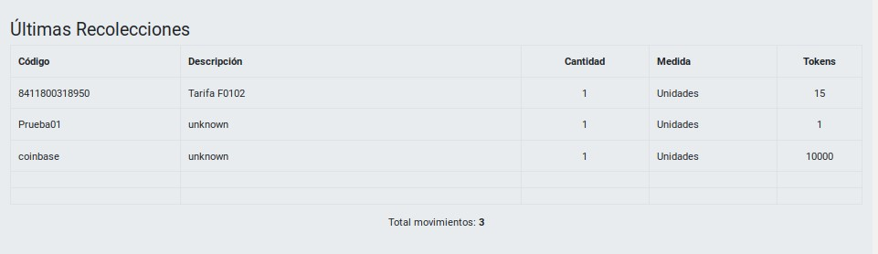

# PEC 1 - Diseño y Desarrollo II
### Realizada por: [Jesús A. Leal Pérez](mailto:lealp22@yahoo.com)
---
# Dapp - Recolección de Envases para Reciclaje

En construcción...


## Indice

- [Acerca esta Dapp](#acerca-esta-dapp)
- [Funcionamiento](#funcionamiento)
- [Estructura](#estructura)
- [Entorno](#entorno)
- [Puntos evaluables](#puntos-evaluables)

---

## Acerca esta Dapp

Esta Dapp intenta simular el mecanismo con el que se le gratificaría a un usuario por la
entrega de envases para su reciclado.

Básicamente se introduciría el código de barras quu está en la etiqueta del envase y, siempre que estuviese registrado en el sistema, se asignaría una cantidad de tokens establecidos por una tarifa definida para dicho envase. En caso de no estar registrado, se asignaría un token por cada unidad recolectada.

  
[Fuente: 20minutos.es](https://blogs.20minutos.es/capeando-la-crisis/2018/02/07/maquinas-que-dan-dinero-por-reciclar-botellas-de-plastico-las-queremos-en-espana/)  

Esta Dapp se ha desarrollado con webpack tomando [Metacoin](https://www.trufflesuite.com/tutorials/building-testing-frontend-app-truffle-3) como punto de partida.

---
## Funcionamiento

La página web de la aplicación lucirá de la siguiente forma:


Contando con los siguientes elementos:

### Panel lateral izquierdo: 

Muestra información sobre la cuenta con la que se está trabajando y la sesión.

Este se compone de:

- **Estado**: Muestra la última acción relevante realizada por la Dapp en relación a la cuenta que se está utilizando.

- **Cuenta**: Dirección de la cuenta con la se está trabajando.

- **Saldo tokens:** Saldo de tokens asignado a la cuenta.

- **Red**: Id de la red sobre la que se está trabajando.

- **Log**: Log en el que se muestra el historial de mensajes que ha aparecido en el recuadro de _'Estado'_.


### Panel 'Recolección':

Area donde el usuario deberá introducir los datos del envase a reciclar y a partir de los cuales se asignarán en compensación un número determinado de tokens:

Los campos son los siguientes:

- **Código**: Codigo de barra que aparece en la etiqueta del envase a reciclar. Puede utilizarse cualquier código, sin embargo, los indicados en [Productos registrados](#productos-registrados) tienen una tarifa asignada y utilizan el oráculo para recuperar el número de tokens a asignar. Para el resto se entrega un token por unidad.

- **Descripción**: Se muestra la descripción asociada al código (si registrada).

- **Cantidad**: Número de unidades entregadas.

- **Medida**: Unidad de medida (Unidades o Kilos).

- **Tokens**: Número de tokens que serán entregados. Si el código está registrado se calculará multiplicando el número de tokens de la tarifa correspondiente por el número de unidades entregadas. Si no, se entregará un token por cada unidad.

- **Botón \[Enviar]**: Botón para realizar la transacción. Se habilita al introducir un código.


### Panel 'Últimas Recolecciones':

En esta área se muestran las últimas 5 transacciones realizadas con la cuenta con que se está trabajando.

Los campos de la tablas corresponden a los campos introducidos en el panel de _'Recolección'_.

Bajo esta tabla se muestra el número total de transacciones de la cuenta.



_Observación_: 
- La cuenta del _owner_ siempre tendrá una primera transacción con el código 'coinbase' que justifica los 10.000 tokens que le son entregados con el despliegue del contrato.
- Actualmente se muestra en la columna _'Descripción'_ la tarifa que se haya utilizado para calcular los tokens. Esto se utiliza así para poder comprobar el valor devuelto por el oráculo.

### Panel 'Información del Sistema':

En esta área se muestra información general del sistema:

- **Tokens en circulación**: Número total de tokens existentes en las cuentas de los usuarios.

- **Usuarios totales**: Número total de usuarios (únicos) que han utilizado la Dapp.

- **Owner**: Dirección del owner del contrato.

- **Paused**: Indica el estado de la Dapp en cuanto a si se ha activado el 'circuit break'.

- **Botón \[Pause]/\[Unpause]**: Botón que permite activar/desactivar la parada del sistema. Solo se habilita para el _owner_. Una vez activada solo se permiten realizar operaciones de consulta o detener por completo el contrato (funcionalidad no implementada en UI)


---

## Productos registrados

Estos son los códigos de barra que actualmente tiene una tarifa asociada y para las que se utiliza el oráculo para obtener el número de tokens que les corresponden.

| Código | Descripción | Tarifa | Tokens |
|--------|-------------|--------|--------|
| 8410128160319 | Agua Mineral Bezoya 50cl | F0101 | 10 |
| 8411547001009 | Agua Mineral Solan De Cabras 75cl | F0101 | 10 |
| 8410297110979 | Leche Entera Asturiana 2,2L | F0101 | 10 |
| 8411800318950 | Trina Naranja 33cl | F0102 | 15 |

La información de estos código es consultadas a través APIs genéricas provistas por [mLab](https://mlab.com).

---

## Estructura de la Dapp

| Directorio | Descripción |
|------------|--------------|
|./app   | Archivos Javascript y plantilla HTML para nuestra Dapp |
|./build | "Artifacts" u objetos generados en la compilación de los Smart Contracts y  que se almacenan en formato JSON. Contiene información importante que la DApp puede aprovechar (por ejemplo, dirección del contrato, ABI) |
| ./contracts  | Archivos fuentes de los Smart Contracts |
| ./migrations | Scripts para la implementación del contrato |
| ./test | Scripts para test unitarios
| ./truffle-config.js | Configuración para Truffle |
| ./webpack.config.js | Configuración para Webpack |

### Entorno

Se requiere tener instalado en el entorno el siguiente software:

- Git
- Npm
- Node.js
- Truffle
- Metamask
- Ganache (opcional)

Las versiones instalas al probar esta Dapp eran las siguientes:

- Truffle v5.0.24  
- Node v8.10.0  
- Solc v0.5.10
- Npm v6.9.0
- Ganacle-cli@6.4.4
- MetaMask v7.1.1

---
## ¿Cómo instalar y ejecutar en local?

Para poder ejecutar en local es necesario realizar los siguientes pasos:

1) Clonar el repositorio desde GitHub:

    $ _git clone https://github.com/lealp22/DYDII_PEC1.git_

2) Entrar al siguiente directorio e instalar dependencias:

    $ _cd DYDII_PEC1/app_
    $ _npm install_

3) Ejecutar Truffle:

    $ _npx truffle develop_

    (En este punto también se podría utilizar _Ganache_, siempre que apunte a la dirección http://127.0.0.1:9545)

4) Abrimos un nuevo terminal y desde el mismo directorio (DYDII_PEC1/app) ejecutamos:

    $ _npx ethereum-bridge -a 9 -H 127.0.0.1 -p 9545 --dev_

    Con este paso se ejecuta el servicio _ethereum-bridge_, necesario para que el oráculo de la Dapp funciones en local

    

5) Compilar los Smart Contracts:

    Desde Truffle: > _compile_
    Desde la línea de comandos (para _Ganache_): $ _truffle compile_

6) Migrar los Smart Contracts:

    Desde Truffle: > _migrate_
    Desde la línea de comandos (para _Ganache_): $ _truffle migrate_

7) Ejecutamos el test unitario para comprobar el correcto funcionamiento:

    Desde Truffle: > _test_
    Desde la línea de comandos (para _Ganache_): $ _truffle test_    

8) Abrimos un nuevo terminal y, una vez ethereum-bridge esté escuchando, ejecutamos (desde el mismo directorio que en los pasos anteriores --DYDII_PEC1/app--):

    $ _npm run dev_

    

9) Completado el paso anterior, ya podemos ejecutar la Dapp desde nuestro navegador con la siguiente url:

    [http://localhost:8080](http://localhost:8080)

Se aconseja importar la primera clave privada de la lista a Metamask, de esta forma se podrá utilizar las funcionalidades disponibles solo para el _Owner_.


---
## ¿Cómo utilizar la Dapp?
...


---
# Puntos evaluables

## LIBRERIA - Utilizar una librería existente de OpenZeppelin o EthPM

Se ha utilizado la librería **Safemath.sol** de OpenZeppelin

Su versión original se puede encontrar en:
[https://github.com/OpenZeppelin/openzeppelin-contracts/blob/master/contracts/math/SafeMath.sol](https://github.com/OpenZeppelin/openzeppelin-contracts/blob/master/contracts/math/SafeMath.sol)

>Sin embargo, se ha modificado para incluir dos funciones nuevas para la suma y resta de enteros de 32 bytes (para los contadores utilizados en _Recycler.sol_)


Mencionar que esta librería no necesita ser desplegada por separado, por lo que no es necesario vincularla en el deploy de los contratos.
Todas las funciones de _Safemath_ son _internal_, por lo que la EVM simplemente la incluye dentro del contrato.

---
## SMART CONTRACTS - Uso de algún mecanismo como Herencia o Factory Contracts

Se han implementado ambos mecanismos:


### 1) Herencia

Se han utilizados los contratos de OpenZeppelin:

**Pausable.sol**

Su versión original se puede encontrar en:
[https://github.com/OpenZeppelin/openzeppelin-contracts/blob/master/contracts/lifecycle/Pausable.sol](https://github.com/OpenZeppelin/openzeppelin-contracts/blob/master/contracts/lifecycle/Pausable.sol)

> En nuestro caso se han hecho algunas modificaciones:
>- Se simplifica para que el owner del contrato sea la única persona que pueda invocar las funciones _pause()_ y _unpause()_.
>- Se incluye herencia de _Ownable.sol_ para poder implementar el cambio anterior.

**Ownable.sol**

Su versión original se puede encontrar en:
[https://github.com/OpenZeppelin/openzeppelin-contracts/blob/master/contracts/ownership/Ownable.sol](https://github.com/OpenZeppelin/openzeppelin-contracts/blob/master/contracts/ownership/Ownable.sol)

> Se ha utilizado una versión antigua adaptada para que la dirección del owner sea payable y se le pueda transferir el saldo del contrato sin necesidad de hacer posteriores conversiones de la dirección (de _address_ a _address payable_).

También se ha utilizado el contrato de _Provable_:

**provableAPI_0.5.sol**

En este se incluye todos los contratos necesarios para trabajar con oráculos.

Su versión original se puede encontrar en:
[https://github.com/provable-things/ethereum-api/blob/master/provableAPI_0.5.sol](https://github.com/provable-things/ethereum-api/blob/master/provableAPI_0.5.sol)


**En resumen:**
* El contrato _Pausable_ hereda de _Ownable_ 
* El contrato _Recycler_ hereda de _Pausable_ y _usingProvable_ (en provableAPI_0.5.sol), implementando todas las funciones de estos tres contratos.

>_contract Pausable is Ownable_  
>_contract Recycler is usingProvable, Pausable_  


### 2) Factory Contracts

Se ha creado el contrato **UserFactory** (en _Recycler.sol_) encargado de gestionar por separado los movimientos de tokens de cada uno de los usuarios (direcciones) que utilicen la dapp.

En el contrato _Recycler_, dentro de los datos de cada usuario (struct user), se incluye el _factory contract_ (userContr) que gestionará sus movimientos:
````
    //* Estructura para datos de usuarios
    struct User {
        uint    balance;
        uint    dtUltMvt;
        uint32  countMvts;
        uint32  seq;
        UserFactory userContr;
    }
````
---
## SMART CONTRACTS - Implementar una parada de emergencia en el contrato (Circuit Breaker / Emergency Stop)

Se implementa una parada de emergencia a trávez de las funciones **Pause()** y **Unpause()** definidas en _Pausable.sol_ y la utilización de los modificadores **whenNotPaused()** y **whenPaused()** en algunas de las funciones del contrato principal _Recycler_.

Esta implementación se ha hecho a través de un botón de **"Pause"** que aparece al final de la pantalla y se habilita únicamente cuando la _address_ activa es la del _owner_ del contrato. Además, se muestra el estado actual del contrato:


Esto es gestionado a través de los eventos **Paused()** y **Unpaused()**.

## SMART CONTRACTS - Medidas adoptadas en los contratos en cuanto a seguridad para evitar ataques típicos.

## SMART CONTRACTS - Posibles patrones de actualización que usaría en el contrato (No es necesario realizar la implementación)

## SMART CONTRACTS - Comentar los contratos según lo indicado en https://solidity.readthedocs.io/en/latest/layout-of-source-files.html#comments

Se han incluido los comentarios en Recycler.sol

---
## TESTING - Justifiación test creados y explicación función que realizan cada uno.

**- Test "Se crea un usuario correctamente con el despliegue del contrato"**

Intenta validar las acciones realizadas con el despliegue del contrato (_constructor_).
  
Se valida que:
- Tras el despliegue el contador de usuarios es 1
- Que la dirección de ese primer usuario es la primera cuenta (coinbase)
     
  
**- Test "El sado de la primera cuenta y el sado global de la Dapp son 10000 token"**

Complementa el test anterior en intentar validar las acciones realizadas con el despliegue del contrato (_constructor_)_.
     
Se valida que:
- El saldo del primer usuario es 10.000 tokens (asignados en el constructor)
- El usuario tiene registrada una transacción (movimiento) por dichos tokens
- Lo 10.000 tokens se reflejan en el saldo global de la Dapp
     

**- Test "Pago de tokens a una cuenta y registro del movimiento"**

La prueba realiza una transferencia de tokens, que sería la función base de la app, enviando 5 tokens a la cuenta base. Se intenta verificar el estado final de la cuenta de destino y del movimiento que deja constancia de ello.
     
Se valida que:
- El saldo de la cuenta se incrementa en 5 tokens (10.005 tokens)
- El saldo global también se incrementa en 5 tokens (10.005 tokens)
- Se crea una nueva transacción (movimiento) para dicha cuenta (2 mvtos)
- Que los valores de este movimiento coinciden con los enviados
       
**- Test "Pago de tokens a una segunda cuenta con su alta en la Dapp y el registro del movimiento"**

Se intenta realizar una transferencia de 5 tokens a una nueva cuenta, lo que conlleva el alta de esta como usuario del sistema, con lo que se verifica el alta de la cuenta, su estado tras la transferencia y el estado de la Dapp.
     
Se valida que:
- El saldo de la cuenta es de 5 tokens 
- Dicha cuenta tiene un movimiento
- Que los valores de este movimiento coinciden con los enviados
- El contador de usuario de la Dapp se incrementa a 2
- Que este segundo usuario coincide con la cuenta utilizada
- El saldo global se incrementa en 5 tokens (10.010 tokens)
         
  
**- Test "Generación de eventos"**

Se realiza una transferencia de 7 tokens a una nueva cuenta para verificar que se generen
todos los eventos esperados:
     
Se valida que:
- Se ejecuta el evento newUser (alta usuario)
- Se ejecuta el evento newBalance (actualización saldo de tokens)
- Se ejecuta el evento coinSent (transacción realizada)
- Que los valores enviados en el evento cointSent coinciden con los de la transferencia
       
  
**- Test "LLama a una función de Pausable.sol para comprobar la herencia"**
     
LLama a una función de Pausable.sol para comprobar que esta disponible y se puede ejecutar.
     

**- Test "Activar y desactivar la pausa (circuit break) de la Dapp"**
     
En este test se activa y desactiva los estados (Pause/Unpause) con los que se implementa el "circuit break" de la Dapp.
     
Se valida:
- El estado de la Dapp tras ejecutar cada una de las acciones (Pause y Unpause)
- Se emiten los eventos correspondientes
     
  
**- Test "LLama a una función de Ownable.sol para comprobar la herencia"**  
     
LLama a una función de Ownable.sol para comprobar que esté disponible y se puede ejecutar.
     

**- Test "Enviar y recibir Ethers"**
     
Aquí se prueban las funciones disponibles para manejar el saldo en Ethers del contrato.
Por un lado el envío de Ethers desde una cuenta al contrato y por otro el retiro de los fondos para transferirlos al owner.
     
Para ello:
- Se traspasan weis al contrato
- Se consulta el saldo  
- Se traspasan los weis al owner
     
Se valida que el saldo inicial y final son iguales, mientras que el intermedio es superior
     
  
**- Test "Se detiene el contrato (Pause) y se intenta enviar tokens"**
     
Se detiene el contrato (Pause) para activar el "circuit break" y se valida que no se pueden realizarse transacciones

Se comprueba que:
- Cambia el estado del contrato (a paused)
- Se emite el evento Paused()
- Se produce un error al intentar realizar la transferencia


**Observaciones:**

- No se ha podido automatizar el test para comprobar el correcto funcionamiento del
  oráculo. Al haber un callback y necesitar de la utilización de ethereum-bridge
  se ha descartado el test por la complejidad que requería. Sin embargo, sí que se ha probado que funciona en local correctamente desde el Front.


## TESTING - Todos los test se ejecutan satisfactoriamente.

Todos los test se ejecutan satisfactoriamente:


## TESTING - Realizar comentarios sobre el código de los tests.

Todos los tests han sido comentados dentro de test/recycler.js

---
## EXTRAS - Alojar el/los contrato/s en una testnet y verificar el código
Detallar procedimiento e indicar las direcciones

## EXTRAS - Alojar la aplicación en IPFS / Swarm
Detallar procedimiento e indicar los hash

## EXTRAS - Utilizar ENS (no para referirse a un hash de Swarm)
Detallar procediiento y funcionamiento / caso de uso del ENS en la aplicación

## EXTRAS - Uso de oráculos
Detallar procedimiento realizado, añadir guía para el lanzamiento del oráculo y dejar claro su funcionamiento


